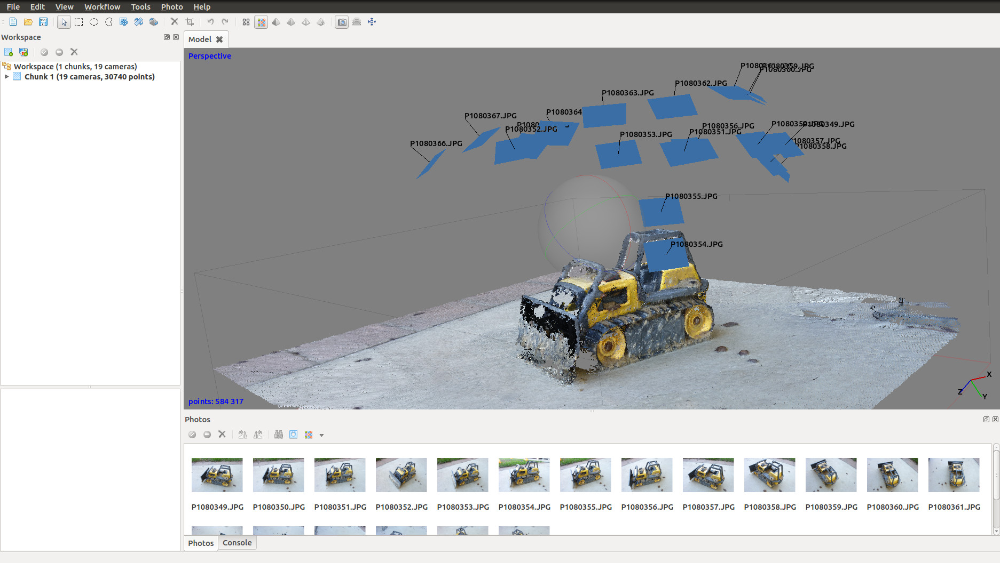
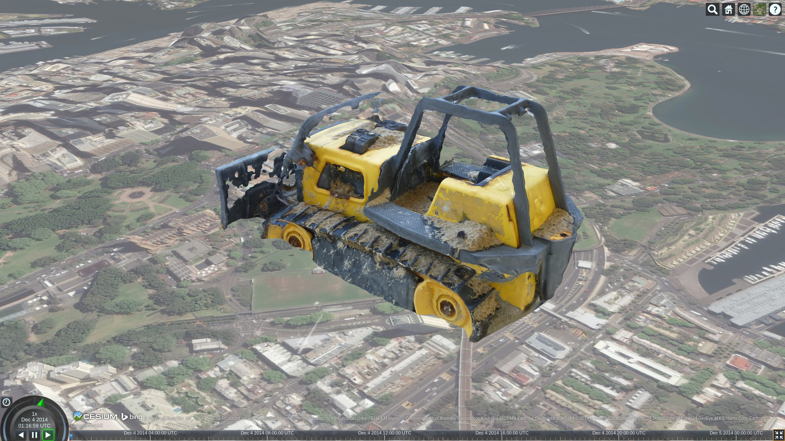

From the real to the virtual world
----------------------------------

It is now surprisingly straightforward to capture 3D objects from the real world and represent them in the Cesium WebGL Virtual Globe.
In the following example we use photogrammetry to generate a simple model of a toy bulldozer from photos.
This 3D model is then converted and loaded into Cesium using glTF.  
In this blog post emphasis is placed on the workflow rather than the quality of the 3D model.
A blatant disregard for accurate scaling has also been leveraged to try to give the impression of a city being destroyed by a giant toy bulldozer.

View the [live demo]()

Capture
-------

Your photogrammetry software should provide recommendations on how to take photos to provide best results.
In general the technique will work best on non-shiny objects, and you'll want to provide some overlap between the photos you take.

For this test a simple consumer Panasonic Lumix DMC-ZR1 was used.  The model captured could have also benefited from a greater number of pictures taken which would have improved the quality of the resulting mesh.

Process
-------

There are a number of photogrammetry software solutions available with different licensing and costs.  Here's some as a starting point...

* [Agisoft PhotoScan](http://www.agisoft.com/)
* [Autodesk RECAP 360](https://recap360.autodesk.com/)
* [Autodesk 123D Catch](http://www.123dapp.com/catch)
* [VisualSFM](http://ccwu.me/vsfm/)
* [openMVG](https://github.com/openMVG/openMVG/)
* [CMVS-PMVS](https://github.com/pmoulon/CMVS-PMVS)
* [OpenDroneMap](https://github.com/OpenDroneMap)
* [MeshLab](http://meshlab.sourceforge.net/) can also be useful for verifying meshes.

For simplicity we'll use a free trial of Agisoft PhotoScan Standard Edition (normally US$179).
The processing in PhotoScan has multiple stages with a few simple options for each stage.

* Import images
* Create a sparse point cloud
* Create a dense point cloud
* Create a mesh
* Create a texture
* Export textured object as Collada

The whole process took around 15 mins to generate this model from photos.  Obviously timing will vary depending on the quality and size of the model you require.

Postprocess
-----------

I wasn't able to convert the PhotoScan Collada model directly to glTF due to some problems with the converter.
To work around this I used the OpenCollada maya plugin to import the model, then re-assigned the shader (as a Maya surface shader).
The model was then re-exported again with the OpenCollada maya plugin.
Make sure texture paths in the Collada model are relative (e.g. change 'file://path/to/my/file.jpg' to 'file.jpg').

Hopefully as the glTF converter improves this postprocess step will not be required.

Convert
-------

Use the Cesium [online converter](http://cesiumjs.org/convertmodel.html) to convert the model to glTF.
If successful you should see a preview of the model in the window.
Any glTF conversion problems can be reported to [glTF issues](https://github.com/KhronosGroup/glTF/issues).

Load into Cesium
----------------

The final step is to load and geolocate your model.
For this test I've created a simple CZML for loading into Cesium and have manually geolocated it, paying no attention to scale.
